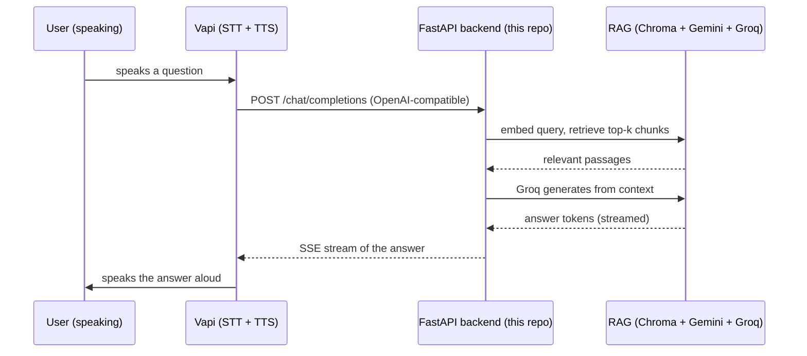

# Delphi

**A voice-first RAG assistant · By Shuja Jamal**

Delphi is a voice assistant that answers out loud from *your* documents. [Vapi](https://vapi.ai) handles the voice, real-time speech-to-text, text-to-speech, streaming, and turn-taking, while a Retrieval-Augmented Generation backend keeps every answer grounded in a knowledge base you control. Ask a question by speaking; Delphi retrieves the relevant passages and speaks back a factual answer.


**Companion app:** _add your Streamlit Cloud URL here after deploying_

---

## How it works

Vapi is configured to use this project's backend as its **Custom LLM**. So instead of Vapi answering from a generic model, it sends the conversation to our endpoint, which runs RAG and streams back a grounded answer for Vapi to speak.



| Piece | Role |
| :--- | :--- |
| **Vapi** | Real-time voice: speech-to-text, text-to-speech, streaming, conversation flow |
| **`server.py`** (FastAPI) | The OpenAI-compatible `/chat/completions` endpoint Vapi calls, plus document management |
| **RAG pipeline** | Gemini embeddings → Chroma vector store → Groq generation, constrained to retrieved context |
| **`app.py`** (Streamlit) | Companion UI: manage documents, try it in text, and launch the Vapi voice widget |

The Streamlit app and the FastAPI backend **share the same Chroma store**, so a document you add in the UI is immediately answerable by voice.

---

## The backend API

| Endpoint | Purpose |
| :--- | :--- |
| `POST /chat/completions` | OpenAI-compatible chat completions (streaming SSE and non-streaming). **This is what Vapi calls.** It treats the last user message as the query, retrieves the top-k chunks, and streams a grounded answer. |
| `GET /documents` | List the indexed documents and chunk counts |
| `POST /documents` | Upload a file (multipart) to add it to the knowledge base |
| `DELETE /documents/{name}` | Remove a document and its vectors |
| `GET /health` | Liveness, whether keys are set, and how many documents are loaded |

Set `BACKEND_SECRET` to require a bearer token on `/chat/completions` (use the same value as the API key on Vapi's custom LLM) so the endpoint is not open to the world.

---

## Setup

**1. Keys** (both free): `GROQ_API_KEY` from [console.groq.com/keys](https://console.groq.com/keys), `GEMINI_API_KEY` from [aistudio.google.com/apikey](https://aistudio.google.com/apikey). A **Vapi account** ([vapi.ai](https://vapi.ai)) for the voice layer.

**2. Install and run locally:**

```bash
git clone https://github.com/<username>/<repo>.git
cd <repo>

python -m venv .venv
.venv\Scripts\activate          # Windows
# source .venv/bin/activate     # macOS or Linux
pip install -r requirements.txt

# put your keys in the environment (or .streamlit/secrets.toml for the UI)
set GROQ_API_KEY=gsk_...         # Windows;  export ... on macOS/Linux
set GEMINI_API_KEY=...

# run the backend Vapi will call
uvicorn server:app --port 8000

# in a second terminal, run the companion UI
streamlit run app.py
```

Add a document in the Streamlit sidebar and ask a question in the **Chat** tab to confirm RAG works in text before wiring up voice.

---

## Wiring up Vapi (the voice layer)

Vapi's servers call your backend, so the backend must be reachable from the internet.

1. **Expose the backend.** For local testing, tunnel it: `ngrok http 8000` gives you a public `https://…ngrok…` URL. For production, deploy the backend (Render, Railway, or Fly all run FastAPI well) and use its URL.
2. **Create a Vapi assistant.** In the Vapi dashboard, set the assistant's model to **Custom LLM** with the URL `https://<your-backend>/chat/completions`. A ready-to-edit config is in [`vapi/assistant.json`](vapi/assistant.json). If you set `BACKEND_SECRET`, put the same value as the custom LLM's API key.
3. **Talk to it.** Either use the test call in the Vapi dashboard, or open the **Voice** tab in the Streamlit app, paste your Vapi **public key** and **assistant ID**, and press *Start voice call*. Delphi will answer aloud from your documents.

> Microphone access can be blocked inside embedded iframes on some browsers. If the widget's mic does not activate in Streamlit, run the voice widget on a standalone HTML page (the same snippet as the Voice tab) or use the Vapi dashboard's test call.

---

## Tests

```bash
python tests/test_backend.py
```

No keys needed. The RAG pipeline is faked, so the tests exercise the exact contract Vapi relies on: OpenAI-compatible responses in both streaming and non-streaming form (the streamed tokens are reassembled and checked), the document endpoints, health, and the bearer-token guard.

---

## Project structure

```
.
├── server.py              FastAPI backend: /chat/completions (Vapi) + document endpoints
├── app.py                 Streamlit companion: document manager, text chat, Vapi voice widget
├── rag.py                 RAG orchestration (retrieve + stream)
├── document_loader.py     Read PDF/TXT/DOCX and chunk
├── embeddings.py          Gemini embeddings
├── vector_store.py        Chroma: index, delete-by-source, similarity search
├── llm.py                 Groq generation (streaming + non-streaming)
├── vapi/assistant.json    Example Vapi assistant (custom-LLM) config
├── requirements.txt
├── .streamlit/            dark theme + secrets template
├── tests/test_backend.py
└── README.md
```

---

## Design and safety notes

**Why Custom LLM instead of Vapi tools?** Making the whole backend Vapi's LLM keeps every turn grounded: Vapi never answers from its own model, so it cannot bypass the documents. The endpoint is plain OpenAI-compatible, so it also works with anything else that speaks that protocol.

**Streaming end to end.** Groq streams tokens, the backend forwards them as OpenAI SSE chunks, and Vapi starts speaking as soon as the first tokens arrive, which keeps the conversation feeling live.

**Keys never leak.** Errors from embeddings, retrieval, and generation are redacted before they leave the process. Protect the public endpoint with `BACKEND_SECRET`, and set spending limits on Groq, Gemini, and Vapi, since a deployed voice agent spends real quota per call.

---

*By Shuja Jamal, July 2026.*
