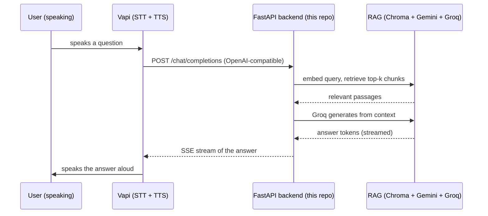

# Delphi

**A voice-first RAG assistant · By Shuja Jamal**

Delphi is a voice assistant that answers out loud from *your* documents. [Vapi](https://vapi.ai) handles the voice, real-time speech-to-text, text-to-speech, streaming, and turn-taking, while a Retrieval-Augmented Generation backend keeps every answer grounded in a knowledge base you control. Ask a question by speaking; Delphi retrieves the relevant passages and speaks back a factual answer.


**Companion app:** _add your Streamlit Cloud URL here after deploying_

---

## How it works

Vapi is configured to use this project's backend as its **Custom LLM**. So instead of Vapi answering from a generic model, it sends the conversation to our endpoint, which runs RAG and streams back a grounded answer for Vapi to speak.



| Piece | Role |
| :--- | :--- |
| **Vapi** | Real-time voice: speech-to-text, text-to-speech, streaming, conversation flow |
| **`server.py`** (FastAPI) | The OpenAI-compatible `/chat/completions` endpoint Vapi calls, plus document management |
| **RAG pipeline** | Gemini embeddings → Chroma vector store → Groq generation, constrained to retrieved context |
| **`app.py`** (Streamlit) | Companion UI, a **thin client** of the backend: it manages documents, tries the RAG in text, and launches the Vapi voice widget, all over HTTP |

The backend is the single source of truth. The Streamlit UI holds no keys and runs no RAG of its own; it calls the backend's HTTP API. So a document added in the UI is the same one the voice agent answers from, whether the two are on the same machine or on different hosts.

---

## The backend API

| Endpoint | Purpose |
| :--- | :--- |
| `POST /chat/completions` | OpenAI-compatible chat completions (streaming SSE and non-streaming). **This is what Vapi calls.** It treats the last user message as the query, retrieves the top-k chunks, and streams a grounded answer. |
| `GET /documents` | List the indexed documents and chunk counts |
| `POST /documents` | Upload a file (multipart) to add it to the knowledge base |
| `DELETE /documents/{name}` | Remove a document and its vectors |
| `GET /health` | Liveness, whether keys are set, and how many documents are loaded |

Set `BACKEND_SECRET` to require a bearer token on `/chat/completions` (use the same value as the API key on Vapi's custom LLM) so the endpoint is not open to the world.

---

## Keys you will need

All free: `GROQ_API_KEY` from [console.groq.com/keys](https://console.groq.com/keys), `GEMINI_API_KEY` from [aistudio.google.com/apikey](https://aistudio.google.com/apikey), and a **Vapi account** ([vapi.ai](https://vapi.ai)) for the voice layer.

---

## Deploy everything online (nothing runs on your machine)

Three hosted pieces: the backend on Render, the companion UI on Streamlit Cloud, and Vapi for voice.

### 1. Backend → Render

1. Push this repo to GitHub.
2. On [render.com](https://render.com): **New + → Blueprint**, select the repo. Render reads [`render.yaml`](render.yaml) and creates the `delphi-backend` web service (build from `requirements-backend.txt`, start with uvicorn).
3. When prompted, set the environment variables: `GROQ_API_KEY`, `GEMINI_API_KEY`, and optionally `BACKEND_SECRET` (a value you choose, to lock down the endpoint).
4. Deploy. Your backend is now live at `https://delphi-backend-XXXX.onrender.com`. Check `…/health` in a browser.

> **Render free-tier notes.** The service sleeps after ~15 minutes idle and cold-starts in roughly a minute, and its disk is ephemeral (uploaded documents reset on restart or redeploy). Both are fine for a demo: re-upload after a restart, and for a live voice demo hit `/health` once first to wake it. A paid instance (always-on + a persistent disk) removes both limits.

### 2. Companion UI → Streamlit Cloud

1. On [share.streamlit.io](https://share.streamlit.io): **Create app**, this repo, branch `main`, main file `app.py`. It installs only the light `requirements.txt` (Streamlit + an HTTP client).
2. In **Advanced settings → Secrets**, point it at the backend:
   ```toml
   BACKEND_URL = "https://delphi-backend-XXXX.onrender.com"
   # BACKEND_SECRET = "the-same-value-if-you-set-one"
   ```
3. Deploy. Upload a document in the sidebar and ask a question in the **Chat** tab to confirm the RAG works end to end, all in the browser.

### 3. Voice → Vapi

1. In the Vapi dashboard, create an assistant and set its model to **Custom LLM** with the URL `https://<your-render-url>/chat/completions`. A ready-to-edit config is in [`vapi/assistant.json`](vapi/assistant.json). If you set `BACKEND_SECRET`, use it as the custom LLM's API key.
2. Talk to it: use Vapi's dashboard test call, or the **Voice** tab in the deployed Streamlit app (paste your Vapi public key and assistant ID). Delphi answers aloud from the same documents.

### Running locally instead (optional)

```bash
pip install -r requirements-backend.txt          # backend deps
set GROQ_API_KEY=gsk_...                          # export ... on macOS/Linux
set GEMINI_API_KEY=...
uvicorn server:app --port 8000                    # the backend

pip install -r requirements.txt                   # UI deps (separate env is fine)
set BACKEND_URL=http://localhost:8000
streamlit run app.py                              # the companion UI
```

For voice against a local backend, expose it with `ngrok http 8000` and use that URL in Vapi.

> Microphone access can be blocked inside embedded iframes on some browsers. If the widget's mic does not activate in Streamlit, run the voice widget on a standalone HTML page (the same snippet as the Voice tab) or use the Vapi dashboard's test call.

---

## Tests

```bash
python tests/test_backend.py
```

No keys needed. The RAG pipeline is faked, so the tests exercise the exact contract Vapi relies on: OpenAI-compatible responses in both streaming and non-streaming form (the streamed tokens are reassembled and checked), the document endpoints, health, and the bearer-token guard.

---

## Project structure

```
.
├── server.py                  FastAPI backend: /chat/completions (Vapi) + document endpoints
├── app.py                     Streamlit companion (thin HTTP client of the backend)
├── rag.py                     RAG orchestration (retrieve + stream)
├── document_loader.py         Read PDF/TXT/DOCX and chunk
├── embeddings.py              Gemini embeddings
├── vector_store.py            Chroma: index, delete-by-source, similarity search
├── llm.py                     Groq generation (streaming + non-streaming)
├── render.yaml                Render blueprint for the backend
├── requirements-backend.txt   backend deps (Render)
├── requirements.txt           UI deps (Streamlit Cloud): streamlit + httpx
├── vapi/assistant.json        Example Vapi assistant (custom-LLM) config
├── .streamlit/                dark theme + secrets template
├── tests/test_backend.py
└── README.md
```

---

## Design and safety notes

**Why Custom LLM instead of Vapi tools?** Making the whole backend Vapi's LLM keeps every turn grounded: Vapi never answers from its own model, so it cannot bypass the documents. The endpoint is plain OpenAI-compatible, so it also works with anything else that speaks that protocol.

**Streaming end to end.** Groq streams tokens, the backend forwards them as OpenAI SSE chunks, and Vapi starts speaking as soon as the first tokens arrive, which keeps the conversation feeling live.

**Keys never leak.** Errors from embeddings, retrieval, and generation are redacted before they leave the process. Protect the public endpoint with `BACKEND_SECRET`, and set spending limits on Groq, Gemini, and Vapi, since a deployed voice agent spends real quota per call.

---

*By Shuja Jamal, July 2026.*
