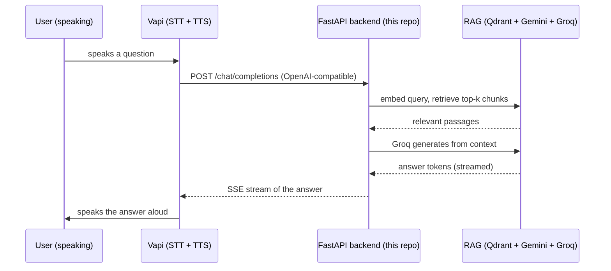

# Delphi

**A voice-first RAG assistant · By Shuja Jamal**

Delphi is a voice assistant that answers out loud from *your* documents. [Vapi](https://vapi.ai) handles the voice, real-time speech-to-text, text-to-speech, streaming, and turn-taking, while a Retrieval-Augmented Generation backend keeps every answer grounded in a knowledge base you control. Ask a question by speaking; Delphi retrieves the relevant passages and speaks back a factual answer.


**Live app:** [rag-voice-assistant-theta.vercel.app](https://rag-voice-assistant-theta.vercel.app) · the deploy serves a built-in web UI with an animated voice orb.

---

## How it works

Vapi is configured to use this project's backend as its **Custom LLM**. So instead of Vapi answering from a generic model, it sends the conversation to our endpoint, which runs RAG and streams back a grounded answer for Vapi to speak.



| Piece | Role |
| :--- | :--- |
| **Vapi** | Real-time voice: speech-to-text, text-to-speech, streaming, conversation flow |
| **`server.py`** (FastAPI) | The OpenAI-compatible `/chat/completions` endpoint Vapi calls, document management, **and a built-in web UI** at `/` |
| **RAG pipeline** | Gemini embeddings → Qdrant vector store → Groq generation, constrained to retrieved context |
| **`app.py`** (Streamlit) | Optional standalone companion (thin HTTP client). The backend already ships its own web UI, so this is only for those who prefer Streamlit |

The backend is the single source of truth: it holds the keys, the documents, the RAG, and the voice endpoint. Deploying it is all you need; it serves a web page to manage documents and chat, and Vapi calls the same endpoint for voice.

---

## The backend API

| Endpoint | Purpose |
| :--- | :--- |
| `POST /chat/completions` | OpenAI-compatible chat completions (streaming SSE and non-streaming). **This is what Vapi calls.** It treats the last user message as the query, retrieves the top-k chunks, and streams a grounded answer. |
| `GET /documents` | List the indexed documents and chunk counts |
| `POST /documents` | Upload a file (multipart) to add it to the knowledge base |
| `DELETE /documents/{name}` | Remove a document and its vectors |
| `GET /health` | Liveness, whether keys are set, and how many documents are loaded |

Set `BACKEND_SECRET` to require a bearer token on `/chat/completions` (use the same value as the API key on Vapi's custom LLM) so the endpoint is not open to the world.

---

## Keys you will need

All free, no credit card:

| Key | From | For |
| :--- | :--- | :--- |
| `GROQ_API_KEY` | [console.groq.com/keys](https://console.groq.com/keys) | answer generation |
| `GEMINI_API_KEY` | [aistudio.google.com/apikey](https://aistudio.google.com/apikey) | embeddings |
| `QDRANT_URL` + `QDRANT_API_KEY` | [cloud.qdrant.io](https://cloud.qdrant.io) (free 1 GB cluster) | the vector store |
| Vapi account | [vapi.ai](https://vapi.ai) | the voice layer |

---

## Deploy on Vercel (fully online, nothing on your machine)

The backend is a serverless FastAPI app. Serverless instances are stateless, which is exactly why the vector store is **Qdrant** (a network database) rather than a local file: every request, on whatever instance, sees the same knowledge base.

### 1. Create a Qdrant Cloud cluster

At [cloud.qdrant.io](https://cloud.qdrant.io), create a free cluster and copy its **URL** and an **API key**. Nothing else to configure; the app creates the collection on first use.

### 2. Deploy the backend to Vercel

1. Push this repo to GitHub.
2. At [vercel.com/new](https://vercel.com/new), import the repo. Vercel reads [`pyproject.toml`](pyproject.toml) and runs the FastAPI app (`server:app`) as a Python function.
3. Under **Environment Variables**, add:
   ```
   GROQ_API_KEY, GEMINI_API_KEY, QDRANT_URL, QDRANT_API_KEY
   BACKEND_SECRET   (optional: a value you choose, to lock the Vapi endpoint)
   ```
4. Deploy. Open the Vercel URL: the backend serves a **built-in web UI** where you can upload documents and chat. That is the whole app, online.

### 3. Point Vapi at it (step by step)

1. **Sign up** at [vapi.ai](https://vapi.ai) and open the dashboard.
2. **Create an assistant.** *Assistants → Create Assistant*, start from a blank template and name it `Delphi`.
3. **Set the model to your backend.** In the assistant's **Model** section choose provider **Custom LLM**, then set:
   - **URL:** `https://rag-voice-assistant-theta.vercel.app/chat/completions`
   - **API key:** only if you set `BACKEND_SECRET`; use the same value.
   - A ready-made config is in [`vapi/assistant.json`](vapi/assistant.json).
4. **Pick a voice and transcriber.** Any provider works; the defaults are fine to start.
5. **Set the first message**, for example *"Hi, I'm Delphi. Ask me anything about your documents."*
6. **Save**, then hit **Talk to Assistant** in the dashboard for an instant test call.
7. **Or use the orb.** Open the deployed site, go to the **Voice** tab, paste your Vapi **public key** (*Vapi dashboard → API Keys → Public Key*) and the **assistant ID** (shown on the assistant page), then tap the orb.

### Make the orb one tap (skip the pasting)

Add two more environment variables in Vercel and the key fields disappear, leaving a site where visitors just tap the orb and talk:

```
VAPI_PUBLIC_KEY     = pk_...     (Vapi dashboard, API Keys, the Public one)
VAPI_ASSISTANT_ID   = your assistant's id
```

Redeploy and the Voice tab is ready to go. The server injects these into the page at request time, so they stay out of git and can be rotated without a commit.

> The Vapi **public** key is designed to run in the browser, which is why embedding it is intended usage rather than a leak; the private key is never used here. Do note that anyone who opens the page can then start a call on your Vapi credits, so keep the URL reasonably private and watch your balance. Leave these variables unset and the site falls back to asking each visitor for their own key.

Upload at least one document first, otherwise Delphi will correctly tell you it has nothing to answer from.

### The voice orb

The Voice tab is built around a large animated orb that reflects who is talking, using the Vapi web SDK's live events:

| State | Look |
| :--- | :--- |
| **Idle** | A dim sphere breathing slowly. Tap it to start a call. |
| **You speaking** | Glows **cyan** and pulses in time with your mic level, with expanding rings (driven by Vapi's `volume-level`). |
| **Delphi speaking** | Glows **violet** and pulses faster (driven by `speech-start` / `speech-end`). |

Tap the orb again to end the call. The page is styled in a retro-modern pairing of **Space Grotesk** for display text and **JetBrains Mono** for labels, and serves its own glowing-orb SVG favicon at `/favicon.svg`.

### Running locally instead (optional)

```bash
pip install -r requirements.txt
set GROQ_API_KEY=gsk_...        # export ... on macOS/Linux
set GEMINI_API_KEY=...
# QDRANT_URL/QDRANT_API_KEY optional locally: without them it uses an in-memory store
uvicorn server:app --port 8000
```

Open `http://localhost:8000` for the web UI. For voice against a local backend, tunnel it with `ngrok http 8000` and use that URL in Vapi. A standalone Streamlit client (`app.py`, deps in `requirements-ui.txt`) is also included if you prefer it over the built-in UI.

---

## Tests

```bash
python tests/test_backend.py
```

No keys needed. The RAG pipeline is faked, so the tests exercise the exact contract Vapi relies on: OpenAI-compatible responses in both streaming and non-streaming form (the streamed tokens are reassembled and checked), the document endpoints, health, and the bearer-token guard.

---

## Project structure

```
.
├── server.py                  FastAPI backend: /chat/completions (Vapi), document endpoints, built-in web UI
├── rag.py                     RAG orchestration (retrieve + stream)
├── document_loader.py         Read PDF/TXT/DOCX and chunk
├── embeddings.py              Gemini embeddings
├── vector_store.py            Qdrant: index, delete-by-source, similarity search
├── llm.py                     Groq generation (streaming + non-streaming)
├── pyproject.toml             Vercel entrypoint (server:app) + backend deps
├── vercel.json                Vercel function config (maxDuration)
├── requirements.txt           backend deps (also used locally)
├── app.py                     optional standalone Streamlit client
├── requirements-ui.txt        deps for the optional Streamlit client
├── vapi/assistant.json        example Vapi assistant (custom-LLM) config
├── tests/test_backend.py
└── README.md
```

---

## Design and safety notes

**Why Qdrant instead of Chroma here?** The earlier version of this project used Chroma with a local file, which is perfect on a normal server. Vercel is serverless: functions are stateless and share no disk, so a document written to disk in one request would be gone when the next request lands on a different instance. Qdrant is a network database, so all instances read and write the same store. It also keeps the function small, well under Vercel's size limit, which a bundled Chroma would strain.

**Why Custom LLM instead of Vapi tools?** Making the whole backend Vapi's LLM keeps every turn grounded: Vapi never answers from its own model, so it cannot bypass the documents. The endpoint is plain OpenAI-compatible, so it also works with anything else that speaks that protocol.

**Streaming end to end.** Groq streams tokens, the backend forwards them as OpenAI SSE chunks, and Vapi starts speaking as soon as the first tokens arrive, which keeps the conversation feeling live.

**Keys never leak.** Errors from embeddings, retrieval, and generation are redacted before they leave the process. Protect the public endpoint with `BACKEND_SECRET`, and set spending limits on Groq, Gemini, and Vapi, since a deployed voice agent spends real quota per call.

---

*By Shuja Jamal, July 2026.*
